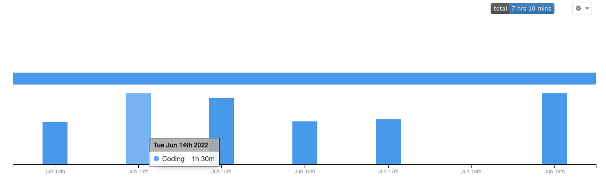

# 코드숨 2주차 회고

## 2주차에는 무엇을 했는가?
2주차에는, 1주차때 작성했는 API 서버를 스프링으로 다시 짜보는 과제를 진행했다. 직접 전부 짤때와는 달리, 많은 기능들이 이미 Spring 에서 제공을 하고 있기 
때문에 훨씬 빠른 속도로 개발을 진행 할 수 있다. 

## 2주차에는 어떠했는가?
살면서 이렇게 약속이 많았던 주는 처음이였다. 월화수목금토일 전일에 최소 한개, 토요일은 약속이 세개나 있어서 시간 관리하는게 쉽지 않았다. 
그래도 미리 캘린더에 일정을 등록해 놓고, 언제 할 수 있는지를 미리 정해 놓고, 개발은 월, 화에 거의 전부 끝내고, 나머지 요일에는 피드백을 반영하고 
구조를 고민하는데 집중했다. 

## 잘한 것을 무엇인가?
- 1주차 회고때 생각했던 것은, 1주차 처럼 과제를 한다면 지속 가능한 학습이 불가능할 것이다 라고 결론을 내렸다. 그래서, 개인 시간과 과제 시간을 적절하게
트레이드 오프해서 최적점을 찾아나가는 중이다. 이번 주 일정이였던 7일 연속 약속은 내 인생에서 outlier 이고, 3주차에는 조금 더 optimal point
를 찾아보도록 하겠다. 
- 월요일날 구조 자체가 좋든 나쁘든 간에 구조에 대한 스켈레톤을 다 짠 점이 가장 잘 한 것 같다. 구조나 추상적인 문제에 대한 결론은 
금방 나지 않는 법이다. 이러한 부분을 첫날에 하면서 얻은 수 있는 장점은 다음과 같다. 첫번째, 후에 진행할 작업들이 명확해 진다. 두번째, 구조에 대한 
피드백을 받고, 고민을 할 시간이 충분하다 + 완정을 위해서 코딩을 하는 일과 고민이 병행이 가능하다. 앞으로 월화는 실제 작업 안하더라도, 작업을 할
파일이나 함수 프로토타입 정의들을 먼저 해놓고 시작하는게 좋을 것 같다. 
- 세번째로 잘한건 시간 로깅이였다. 예전에 사용했었던 wakatime 플러그인을 사용해서, 내가 언제 얼만큼 과제를 진행했는지 로깅했다. 1주차의 문제점이 너무 
늦은 시간까지 과제를 붙잡는 것이였다. 금주는 제일 늦게까지 작업한 것이 새벽 두시 였고 (1주차는 4시였다), 일 평균 에디터에서 1시간 10분 정도의 시간을 투자했다.
실제로 PR 리뷰하고, 자료조사하는 시간을 생각하면, 그것 보다는 더 되겠지만 1주일 풀약속이였던 주에 이정도면 선방했다고 생각한다. 

## 개선 할 점은 무엇인가?
- 새로운 것을 시도할때 리서치를 조금 해보는 것이 좋을 것 같다. 그 예시가 Optional 과 Javadoc 에 관한 거였다. 1주차의 주된 고민이 null 에
관한 것이였는데, 그 부분에 대한 해결책으로 도입한 것이 `Optional` 이였다. 근데, 해당 기능에 대해 조사하다보니, 안티패턴이 무려 26 개나 되는
엄청난 클래스 였다. [레퍼런스](https://dzone.com/articles/using-optional-correctly-is-not-optional) 실제로 과제에서 `Optional` 
을 사용하다, 비슷하게 사용한 적이 있어 고친 경험이 있다. 
- Javadoc 도 마찬가다, CR 에서 자바독을 써보자 라는 피드백을 받아 아무 생각없이 그냥 추가를 했다. 만약에 다른 Java 의 문서를 보고
어떤 식으로 적어야하는지 [예시](https://docs.oracle.com/javase/8/docs/api/java/util/HashMap.html#replace-K-V-)를 봤더라면, 조금 더 효과적으로 새로운 기능을 사용했을 것이다. 